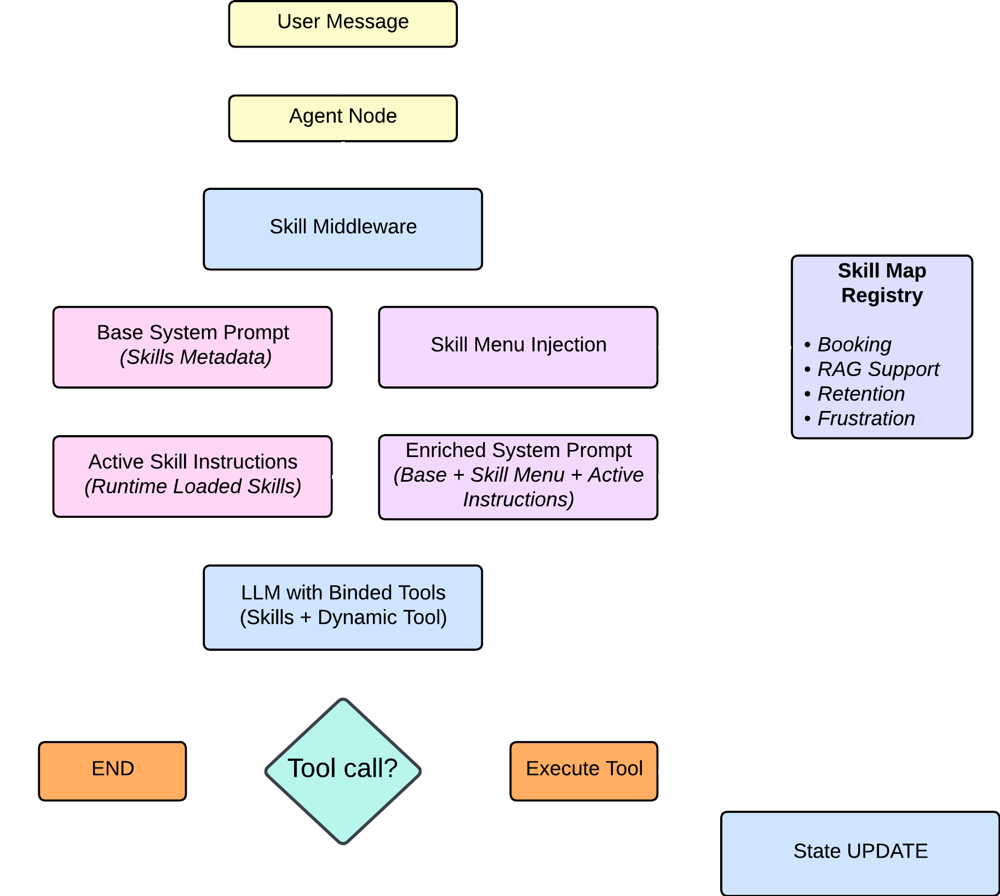

## LangChain Skills

A modular skills-based agent architecture using LangChain tools, where each user request is routed to a specialized skill for deterministic and reliable responses.

Instead of a single monolithic chatbot, the system uses multiple specialized skills, each responsible for a specific domain.

